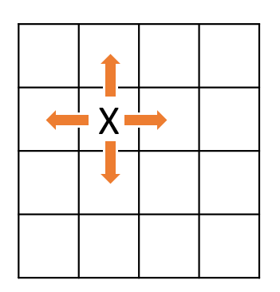
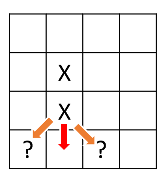
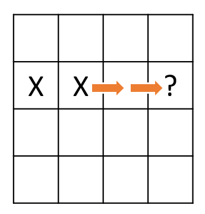
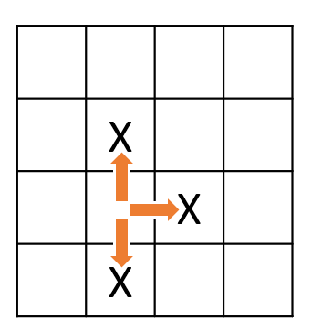

## Welcome to 😺 Emoji Swap!

### [Demo](demo-0.2.0/) Play the game!

### [GitHub](https://github.com/daveteply/emoji-swap) A link to the project source

### Discussion and Algorithm

#### Emoji Rendering

I thought of using emojis due to their popularity, fun, and wide-spread compatibility. The first trick was to get the emoji to render on a web page based on its code.

Starting with the [Full Emoji List](https://unicode.org/emoji/charts/full-emoji-list.html), the first emoji listed is `1F600` which is the 😀 or “grinning face”. After some work, I discovered that this is how to render an emoji using Angular:

```
<div [innerHTML]="&#x1F600"></div>
```

#### Game Board

The next bit of fun was to draw the game board or grid of emojis. I initially thought to use [CSS Grid](https://developer.mozilla.org/en-US/docs/Web/CSS/CSS_Grid_Layout), but decided that most breakpoints where going to be similar so good ole [Flexbox](https://developer.mozilla.org/en-US/docs/Web/CSS/CSS_Flexible_Box_Layout/Basic_Concepts_of_Flexbox) did the trick!

Basic algorithm:

1. Start with a 2-D array in TypeScript ` grid: GameTile[][];`
2. Loop through each dimension's limit (row and column)
3. Add a `GameTile` from a random list of emojis
4. See: src\app\game\services\game.service.ts: `CreateGame(`

#### Finding Matches and Potential Matches

For the game to function, I needed a mechanism that would quickly tell me if there existed a match on the board.  This mechanism would then be ready for any scenario:
- after the game board was established
  - new game instance
  - level change
  - reshuffle
- after player interaction
- after a previously found match was removed and new tiles added
This would equip the game with the ability to react to any of the above events.

Matching Algorithm:

For each tile...
1. for each [cardinal direction](https://en.wikipedia.org/wiki/Cardinal_direction)...
  1. is this tile within the grid? 
  2. does this tile have the same emoji code?
     1. add tile to candidate list
     1. recurse until the next tile doesn't match
  3. is candidate list length within threshold? (note: this allows for any length match!)
  
  
If the candidate list happens to be 1 less then the threshold...
1. perform potential match
  1. from the previous tile, look in diagonal directions for potential match
  
  
2. extended potential match
  1. from the previous tile, in the same direction
       1. skip next tile
       2. check next tile
       

There is another category of potential matches - staggered matches. These are searched during the initial find algorithm as it must be acted upon each tile.
For each tile...
1. search in all cardinal directions
2. if tile is within grid, add to list
3. after all directions have been searched
   1. start with the first tile in list
   2. filter remaining tiles that match list
   3. if length of filtered list meets the threshold, potential match found!
   

<!-- You can use the [editor on GitHub](https://github.com/daveteply/emoji-swap/edit/gh-pages/index.md) to maintain and preview the content for your website in Markdown files.

Whenever you commit to this repository, GitHub Pages will run [Jekyll](https://jekyllrb.com/) to rebuild the pages in your site, from the content in your Markdown files.

### Markdown

Markdown is a lightweight and easy-to-use syntax for styling your writing. It includes conventions for

```markdown
Syntax highlighted code block

# Header 1

## Header 2

### Header 3

- Bulleted
- List

1. Numbered
2. List

**Bold** and _Italic_ and `Code` text

[Link](url) and 
```

For more details see [GitHub Flavored Markdown](https://guides.github.com/features/mastering-markdown/).

### Jekyll Themes

Your Pages site will use the layout and styles from the Jekyll theme you have selected in your [repository settings](https://github.com/daveteply/emoji-swap/settings). The name of this theme is saved in the Jekyll `_config.yml` configuration file.

### Support or Contact

Having trouble with Pages? Check out our [documentation](https://docs.github.com/categories/github-pages-basics/) or [contact support](https://github.com/contact) and we’ll help you sort it out. -->
